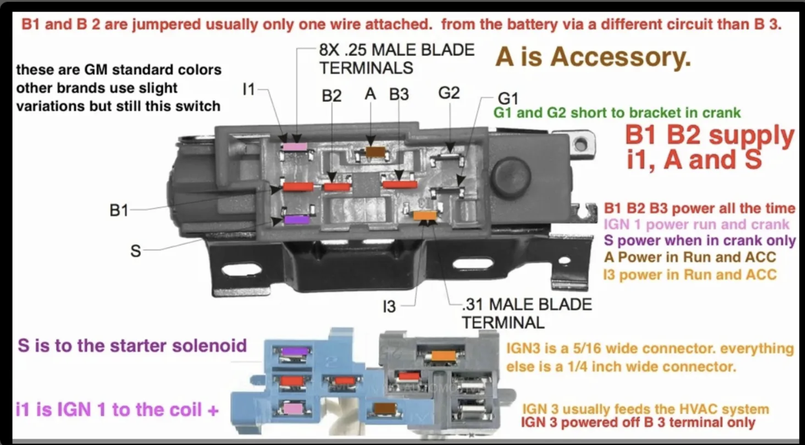
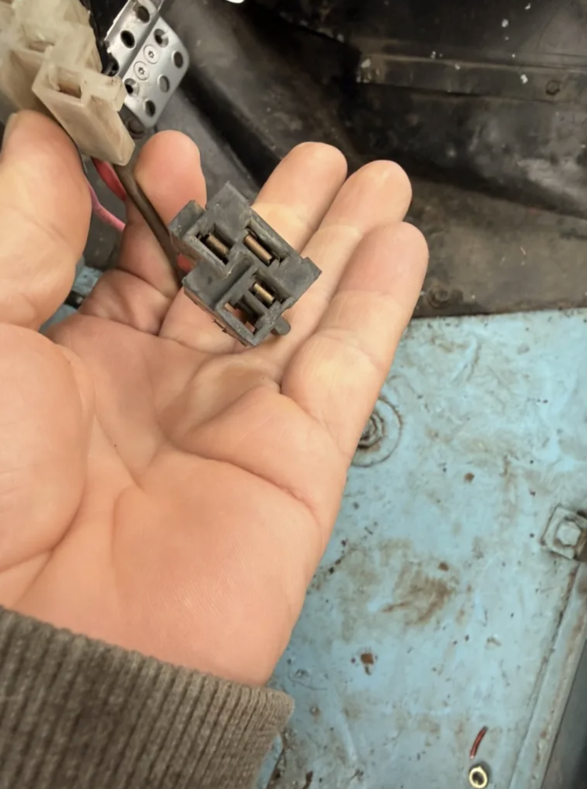

# GM Column Ignition Switch

## Overview

Standard GM column-mounted ignition switch used on this CJ5. The switch body
mounts to the steering column and is actuated by the ignition lock cylinder
via a rod. It is not the lock cylinder itself — it is the electrical switch
behind it.

  

In this build the column switch is **not used**. The ignition switch has been
relocated to the dash (Standard Ignition US105). The column switch connector
is disconnected. The start function is handled by a dash-mounted push button
connected directly to the starter solenoid S terminal. This document covers
the column switch for reference and in case of future re-integration.

## Photos

## Connector Format

8x 0.25" (1/4") male blade terminals. One exception: I-3 uses a 0.31" (5/16")
male blade terminal. All other pins are 1/4".

## Pin-Out and Contact States

B-1 and B-2 are internally jumped inside the switch — they are the same
electrical point. Using both allows higher current capacity by splitting the
load across two wires. B-1/B-2 supply I-1, A, and S. B-3 is a separate
battery supply circuit and powers I-3 only.

Position 0 is ACC — hard to reach, requires key pressed in to release steering
column lock. Positions 1 (LOCK) and 2 (OFF) are electrically identical —
mechanically different (column locks in position 1, key removable) but same
contact state. Position 4 (START) is momentary — spring-loaded, returns to
position 3 when pressure is released. Position 4 is not used in this build as
the start function is handled by the dash-mounted push button.

| Pin | 0 (ACC) | 1 (LOCK) | 2 (OFF) | 3 (RUN) | 4 (START) |
|-----|---------|----------|---------|---------|-----------|
| B-1 | on | on | on | on | on |
| B-2 | on | on | on | on | on |
| B-3 | on | on | on | on | on |
| A   | on | | | on | |
| I-1 | | | | on | on |
| I-3 | | | | on | |
| S   | | | | | on |
| G-1 | | | | | gnd |
| G-2 | | | | | gnd |

Contact states verified by measurement on this switch.

**A — Accessory:** Hot in position 0 (ACC) and position 3 (RUN). Powers radio,
wipers, and accessories.

**I-1 — IGN 1:** Hot in position 3 (RUN) and position 4 (START). In a stock GM
system goes to coil positive. Not used in this build — ignition trigger is
handled by the IGN/RUN relay fed from the dash-mounted US105 switch.

**I-3 — IGN 3:** Hot in position 3 (RUN) only. Typically feeds HVAC blower.
Uses 5/16" terminal — larger than all other pins. Powered from B-3 only. Not
used in this build.

**S — Starter solenoid trigger:** Hot in position 4 (START) only. Triggers the
starter solenoid S terminal — same function as the dash-mounted start button.
Not used in this build.

**G-1 / G-2:** Ground to bracket in position 4 (START) only. Used for oil
pressure and coolant temp warning bulb check during cranking. Not used in this
build — no warning bulb circuits installed.

## Integration With Relay System (if re-connecting)

- B-1/B-2 → battery positive (fused, 14 AWG fusible link)
- B-3 → battery positive (separate fused circuit, 14 AWG fusible link)
- A → ACC relay coil trigger (pin 86)
- I-1 → IGN/RUN relay coil trigger (pin 86)
- S → starter solenoid S terminal (replaces dash start button)
- I-3 → HVAC blower if installed
- G-1/G-2 → leave unconnected (no warning bulb circuits on this build)

## Connector / Pigtail

Two connectors mate to this switch:

**Main connector (positions 1-4 and 1-5):**
- [Duralast 263](https://www.autozone.com/p/duralast-ignition-switch-connector-263/524614) — AutoZone
- [Pico 5659PT](https://www.summitracing.com/parts/pco-5659pt) — Summit Racing.
  10, 12, and 20 AWG wire leads. Not weather-resistant. Sold individually.

The gray connector in photos is the smaller 4-pin section; the larger
connector covers the remaining terminals.

## Fusible Links

GM factory practice uses 14 AWG fusible links on B-1 and B-3 feeds. If not
running HVAC on B-3, drop to 16 AWG. Size to actual load.

## Source

Pin function reference: [hotrodders.com ignition switch identification thread](https://www.hotrodders.com/threads/ignition-switch-identification.407881/)
