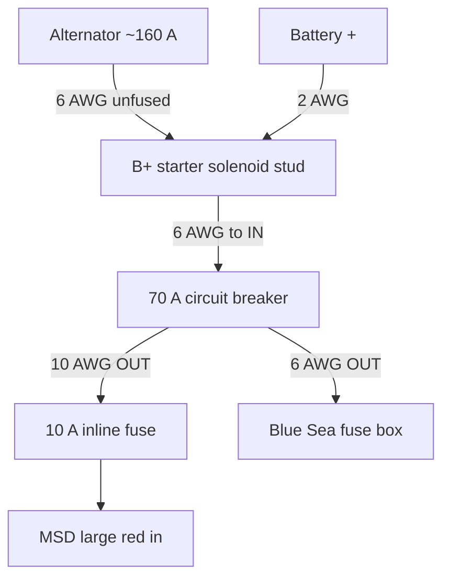
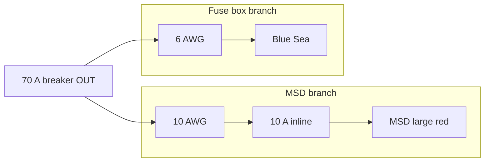

# Starter B+ distribution (alternator, breaker, MSD, fuse box)

The **starter solenoid B+ stud** is the central junction. This matches the as-built plan below; adjust if your stack order differs.

**Safety:** The **alternator** feed is **unfused** to B+ (normal). With the engine running, the alternator can still energize B+ after the battery is disconnected—treat the stud as live. Tripping the **70 A breaker** removes power to the **MSD** and **Blue Sea** branches that run **from that breaker’s output**, but **B+** can still be hot from the alternator and battery until those are isolated.

---

## Diagram 1 — Full path (authoritative)

| Path | Wire | Protection / destination |
|------|------|-------------------------|
| Alternator → B+ | **6 AWG** | **No fuse** (single cable to stud) |
| B+ → Battery + | **2 AWG** | Main battery connection |
| B+ → breaker **IN** | **6 AWG** | Feeds breaker |
| Breaker **OUT** → MSD | **10 AWG** → **10 A** inline fuse → MSD **large red** | Branch fuse sized for MSD feed |
| Breaker **OUT** → panel | **6 AWG** → **Blue Sea** fuse block | ATC branches from there |

**MSD ground:** Large black to chassis (not shown)—see [msd-6200/README.md](../msd-6200/README.md).

---

## Diagram 2 — Breaker outputs only (MSD vs fuse box)

Use this when talking about “what leaves the 70 A breaker.”

---

## Related

- [circuits.md](circuits.md) — broader protection map and relay tables  
- [README.md](README.md) — harness, Blue Sea 5032, breaker choice  
- [../alternator/README.md](../alternator/README.md) — alternator part and belt  
