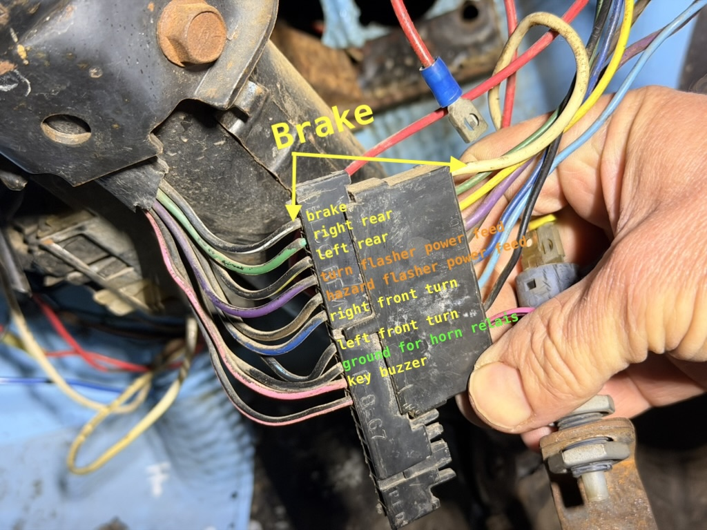

# Column multifunction switch (turn / brake / indicators)

Functions include **brake lights**, **turn indicators**, **hazard**, **horn**, etc. (not the ignition switch—see [column-switch/](../column-switch/) for ignition).

## Connector: GM 3 7/8" turn signal (Haywire & Co.)

**Part (reference):** **Haywire & Co., LLC** — *Connector, GM 3 7/8" Turn Signal* — **GM OEM turn signal connector**, **3 7/8"**, **column side**, **male with terminals**.

This is a **connector** assembly, not a “9-terminal” switch body by itself; the wire table matches this **GM turn-signal** shell and typical GM column wiring practice. The **brake input (BW)**—black/white—comes in, then is **switched** to **green** or **yellow/black** depending on **turn signal position**. The **flasher feeds** are **separate**: **purple/black** for **turns** and **brown/black** for **hazards**, so the two systems **do not interfere** with each other.

The **same color code** is used by **Eckler’s**, **Lectric Limited**, and similar **GM restoration** suppliers if you need to **cross-reference** or source a **pigtail**.

### American Autowire steering column kit (1969+ GM columns)

**American Autowire 500428** — *GM Steering Column Kit* — for **1969 and newer** GM steering columns. The kit includes:

- (1) **Male** and (1) **Female** **3-7/8 in.** connectors  
- (1) **Male** and (1) **Female** **4-1/4 in.** connectors  

The **3-7/8 in.** pair is the same **connector size family** as the **3 7/8"** turn-signal connector above (Haywire column-side male, etc.); the **4-1/4 in.** pair covers the other common GM column connector shell on those columns.

## External references

- **[Steering Column Wiring Guide](https://www.speedwaymotors.com/the-toolbox/steering-column-wiring-guide/28822)** (Speedway Motors / The Toolbox) — overview of column electrical connections, plug letters, and troubleshooting (includes ididit-oriented video; concepts apply broadly to GM-style column harness work).

## Annotated reference

## Cable colors → signal → harness color in car

| Cable color (stock / visible) | Signal | My color (harness in car) |
|-------------------------------|--------|---------------------------|
| black / white | Brake | |
| green | Right rear | |
| yellow / black | Left rear | |
| purple / black | Turn flasher | |
| brown / black | Hazard flasher | |
| blue / black | Right front | |
| light blue / black | Left front | |
| black | Horn | |
| pink | Key buzzer | |

**BW** = brake (black/white). Use **My color** for the wire you actually run in the Jeep (harness / Painless branch).

## Revision

| Date | Change |
|------|--------|
| | Haywire 3 7/8" connector; American Autowire 500428; Speedway column wiring guide link; cable table; Eckler’s / Lectric Limited |
