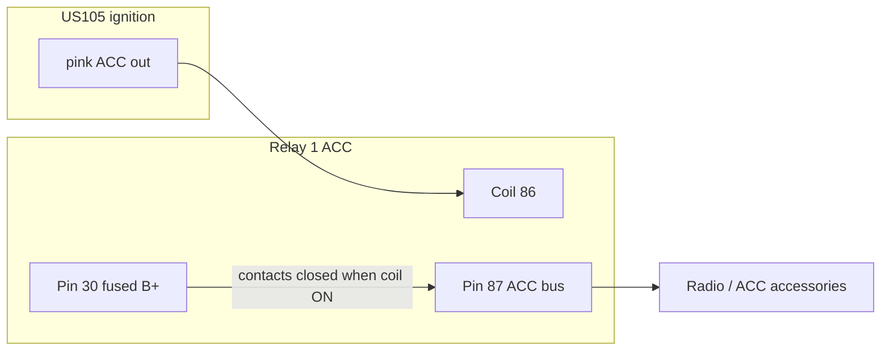
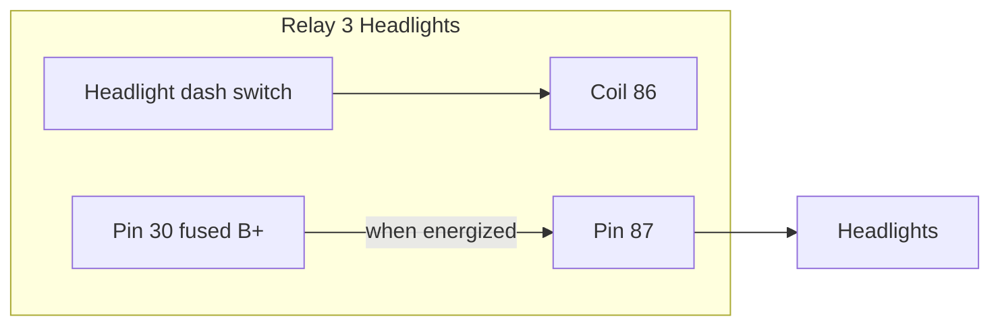
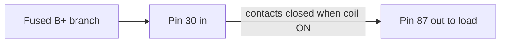

# Switch & Bus Diagrams

How **“always on”** is used in this build:

- **Relay pin 30 feeds** are **always hot** (fused **B+**) whenever the battery is connected—the relay only *connects* that feed to the load when its coil is energized.
- **ACC loads (e.g. radio)** are **not** on 24/7 from the battery. They sit on **Relay 1’s output (pin 87)** and are **on in both ACC and RUN** (US105 keeps the pink ACC output closed in RUN too), and **off when the key is OFF**.

See [overview.md](../overview.md) for full relay tables.

---

## 1. ACC bus — radio and other “key-on” accessories

Relay **1** is energized whenever the ignition is in **ACC** or **RUN**. The **radio** and similar accessories tap the **ACC bus** from pin **87** (often through a harness fuse). The **dash switch** for the radio (power/on) only sees **low current** if you use the harness design; the **high current** path is fused at the panel or relay branch.

**Key positions**

| Key | Relay 1 | Radio / ACC bus |
|-----|---------|-----------------|
| OFF | de-energized | **Off** |
| ACC | energized | **On** |
| RUN | energized | **On** |

So the radio behaves “always on” **while the key is in ACC or RUN**, not while the vehicle is parked with the key out.

---

## 2. Key-independent switch — example: headlights (Relay 3)

The **headlight** dash switch energizes **Relay 3’s coil** without needing the ignition key in RUN. **Pin 30** is still **always-hot** (fused); the **switch** only controls the **relay coil** (low current), not full lamp current.

Lamps are **off** when the switch is off, even if the key is OFF—subject to how you wired the coil feed per [overview.md](../overview.md).

---

## 3. “Always hot” vs “switched output” on one relay

**Fused B+** is always present at **pin 30** (when the battery is connected). The **coil** does not power the load—it only **closes the contacts** so **30** connects to **87**. Until then, the load on **87** sees no power.

Use this for **any** ISO relay: **30** = hot feed in; **87** = switched feed to the load; **85/86** = coil only.

---

## Related

- [README.md](README.md) — inventory, column stalk, headlight switch  
- [../fuse-box/](../fuse-box/) — fuses and panel  
